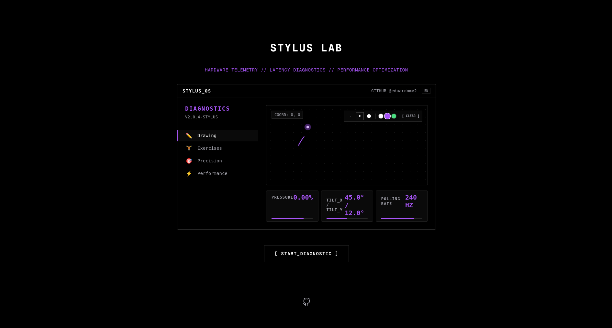
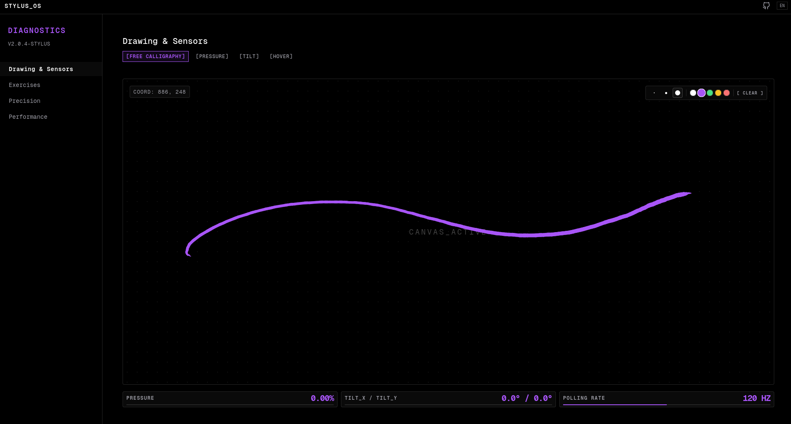
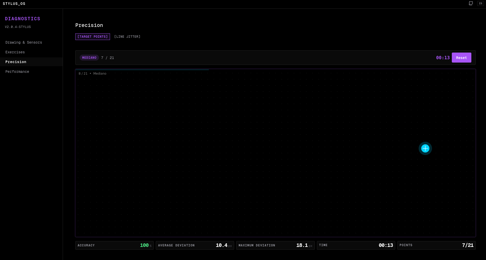
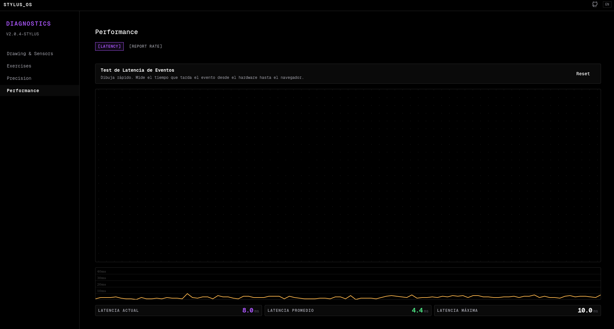

# Stylus Lab (TabletTest)

A high-performance, web-based diagnostic application to evaluate the capabilities of graphics tablets and styluses directly in the browser.

> [!NOTE]
> Este es un proyecto de uso personal. Si te resulta útil, eres totalmente libre de usarlo, modificarlo o adaptarlo como desees.

## Features

- **Free Calligraphy & Drawing Sensors:** Real-time monitoring of pressure and tilt.
- **Precision Targets:** Hand-eye coordination and hardware accuracy testing (Aim Lab style).
- **Latency & Polling Rate:** Oscilloscope-style visualization of polling rates up to 240Hz+.
- **Guided Exercises:** Stroke jitter and line smoothness tracing.
- **Native Web API:** Leverages PointerEvents and Canvas 2D for maximum telemetry accuracy.

## Screenshots

| Landing Page | Drawing Canvas |
|:---:|:---:|
|  |  |

| Precision Targets | Latency & Polling |
|:---:|:---:|
|  |  |

## Development

1. **Install dependencies:**
   ```bash
   npm install
   ```

2. **Run dev server:**
   ```bash
   npm run dev
   ```

3. **Build:**
   ```bash
   npm run build
   ```

Developed by [@eduardomv2](https://github.com/eduardomv2).
